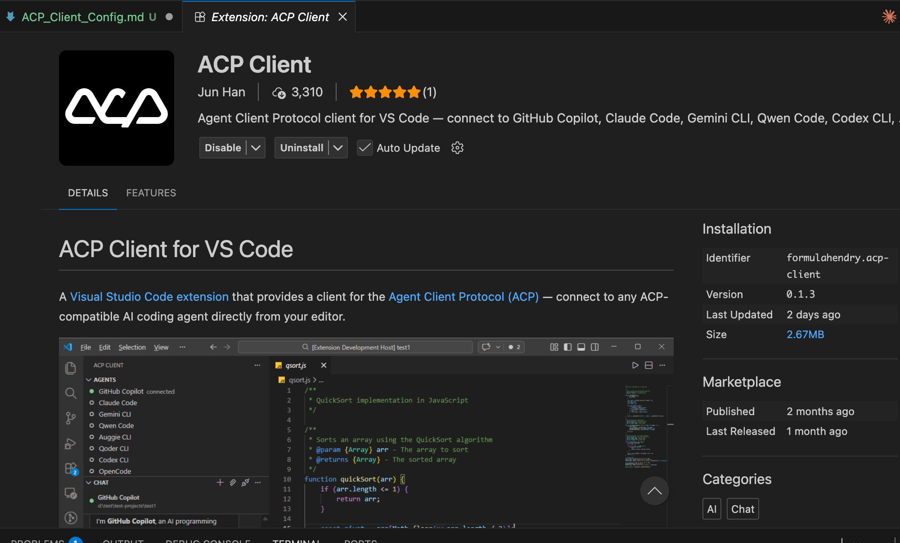
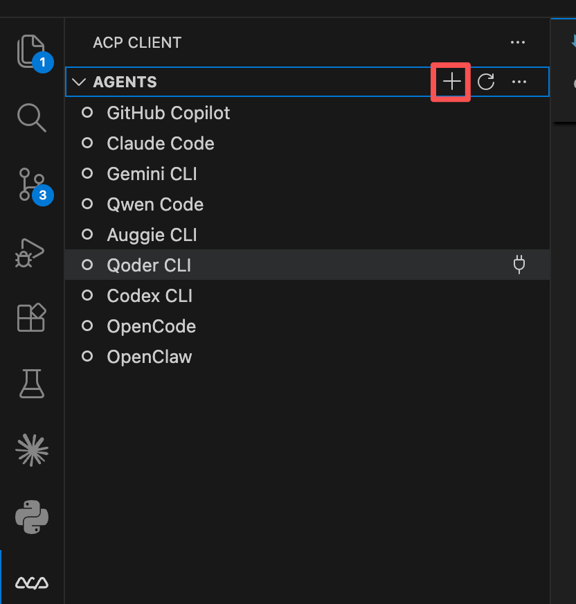
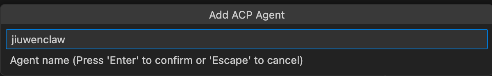

# 快速开始

JiuwenClaw支持VS Code对接ACP客户端
安装前准备：
- 环境依赖：
  - 完成JiuwenClaw安装
  - Web前端界面`设置-配置信息-模型配置`完成模型配置

**注意：用户可根据自己实际需要，基于以下方案完成安装配置。**
**以下以MacOS VS Code对接ACP客户端为例**

# MacOS/Linux VS Code ACP Client插件配置流程
1. 推展市场安装 ACP Client 插件，搜索应用命`formulahendry.acp-client`并完成插件安装.

2. 插件内点击`+`按钮（`ACP: Add Agent Configuration`）.

3. `Add Acp Agent`：输入`jiuwenclaw`.

4. `Agent Command`：输入`run_gateway_acp.sh`的绝对路径
5. `Agent Arguments`：留空
6. 先在命令行启动主进程：`python -m jiuwenclaw.app`
7. 插件内连接 `jiuwenclaw` 后在 chat 窗口进行对话

# Winodws VS Code ACP Client插件配置流程
1. 推展市场安装 ACP Client 插件，搜索应用命`formulahendry.acp-client`并完成插件安装.
2. 插件内点击`+`按钮（`ACP: Add Agent Configuration`.
3. `Name`：输入`jiuwenclaw`.
4. `Command`：输入`run_gateway_acp.cmd`的绝对路径
5. `Config`：留空
6. 先在命令行启动主进程：`python -m jiuwenclaw.app`
7. 插件内连接 `jiuwenclaw` 后在 chat 窗口进行对话
